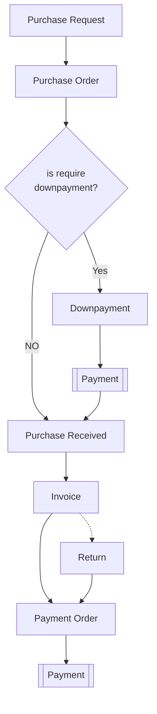

# Introduction

The purchasing process is tightly integrated with other modules in an ERP system, such as inventory management, accounts payable, and warehouse management

## Flowchart

Purchasing flow streamlined process of managing the procurement and purchasing activities within an organization

