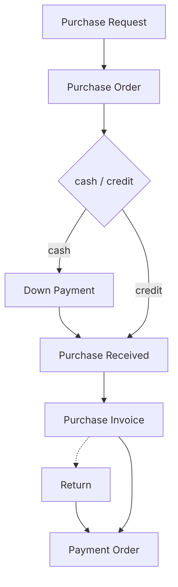

# Purchasing

Process of buying goods for a business or organization. 

```mermaid
%%{init: {'themeVariables': { 'fontSize': '16px', 'fontFamily': 'Inter'}}}%%
flowchart TD

%% nodes %%
PR@{ shape: rect, label: "Purchase Request" }
PO@{ shape: rect, label: "Purchase Order" }
PO-OPT@{ shape: diamond, label: "cash / credit" }
PDP@{ shape: rect, label: "Down Payment" }
PRE@{ shape: rect, label: "Purchase Received" }
PI@{ shape: rect, label: "Purchase Invoice" }
PRN@{ shape: rect, label: "Return" }
PPO@{ shape: rect, label: "Payment Order" }

%% flows %%
PR --> PO --> PO-OPT
PO-OPT -- cash --> PDP --> PRE
PO-OPT -- credit --> PRE
PRE --> PI
PI -.-> PRN --> PPO
PI --> PPO

%% links %%
click PR "/apps/erp/purchasing/purchase-request/about"
click PO "/apps/erp/purchasing/purchase-order/about"
click PDP "/apps/erp/purchasing/purchase-down-payment/about"
click PRE "/apps/erp/purchasing/purchase-received/about"
click PI "/apps/erp/purchasing/purchase-invoice/about"
click PRN "/apps/erp/purchasing/purchase-return/about"
click PPO "/apps/erp/purchasing/purchase-payment-order/about"
```