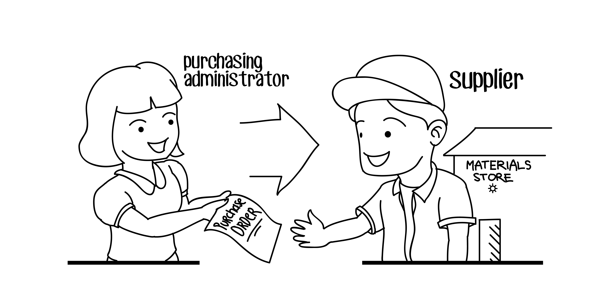

# Purchase Order

A purchase order (PO) is a formal document used by a buyer to request goods or services from a seller, often after a purchase request has been approved. It outlines the specifics of the purchase, including the items or services requested, the agreed-upon price, delivery dates, and other terms and conditions. It serves as a legally binding contract once accepted by the seller.

Key Elements of a Purchase Order:
PO Number: A unique identifier for the purchase order that helps track it in the system.
Buyer Information: Includes the company name, address, and contact details of the person or department making the purchase.
Seller Information: Includes the vendor's name, address, and contact details.
Order Date: The date the purchase order is issued.
Item or Service Details:
Description of the items (e.g., product name, part number, or service description)
Quantity: The amount of each item.
Unit Price: The cost per unit of the item or service.
Total Price: The total cost for each item or service (Quantity x Unit Price).
Delivery Terms:
Delivery Date: When the goods or services are expected to be delivered.
Shipping Instructions: Specifics like delivery address, shipping method, or any special instructions.
Payment Terms: Information on how and when payment will be made (e.g., Net 30, upon delivery, etc.).
Terms and Conditions: Legal and contractual terms governing the purchase, such as return policies, warranties, and liability clauses.
Authorized Signature: The signature or approval of the person making the purchase, typically a manager or authorized purchasing agent.

Process of Creating and Using a Purchase Order:

Issuing the Purchase Order: Once a purchase request has been approved, the procurement team or the person responsible creates a purchase order. This PO is sent to the vendor.
Vendor Confirmation: The vendor reviews the PO and confirms their ability to fulfill the order under the specified terms. If everything is in agreement, the vendor will acknowledge the PO, often by sending an order acknowledgment.
Delivery of Goods/Services: The vendor delivers the goods or performs the services according to the terms outlined in the purchase order.
Receiving and Inspection: Upon delivery, the buyer inspects the goods or services to ensure they match the specifications in the PO. If everything is correct, the buyer may proceed with the next step.
Invoice Matching and Payment: The buyer will match the vendor’s invoice with the purchase order and receiving report to ensure the goods/services were delivered as agreed and in the correct quantities and condition. If everything matches, payment is processed according to the agreed-upon terms.
Record Keeping: Both the buyer and the seller keep copies of the purchase order for future reference, audit purposes, and financial records.

Why Purchase Orders Are Important:
Legal Protection: A PO serves as a legally binding contract between the buyer and seller.
Clarity and Transparency: POs ensure that both parties are clear about the products/services being purchased, quantities, and prices.
Budget Control: By issuing POs, organizations can maintain better control over their spending and ensure they don’t exceed their approved budget.
Record Keeping and Auditing: POs provide a record of all transactions, which is useful for accounting and audits.
Dispute Resolution: If there’s a disagreement about terms or delivery, the PO can be referenced to resolve issues.
