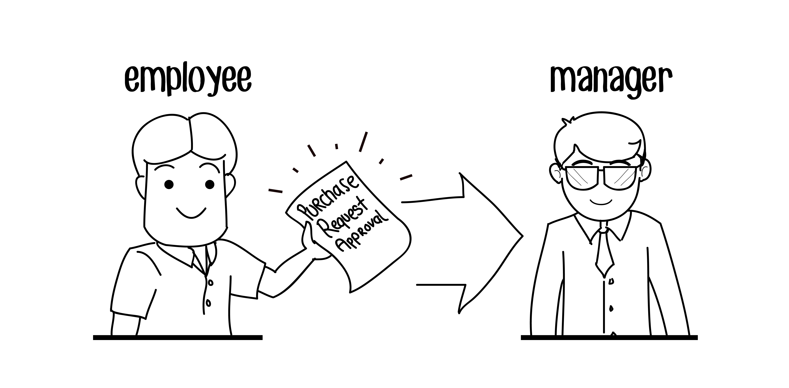

# Purchase Request

A purchase request is typically a formal document used in organizations to request the procurement of goods or services. It usually contains details like the item or service needed, quantity, price, and justification for the purchase.

If you're asking how to create or process purchase requests, here are the general steps:

## Steps

- **Identify the Need:** Clearly define what product or service is needed and why. This could be to fill a gap, restock supplies, or initiate a new project.
- **Specify Details:** Include specifics such as:
  1. Item name or description
  2. Quantity required
  3. Preferred vendor (if any)
  4. When requested item is needed
- **Justification:** Provide reasons for the request—this could include operational needs, legal requirements, or budget availability.
- **Approval:** In most organizations, purchase requests must be approved by a manager or someone in charge of the budget before proceeding to procurement.
- **Submission:** The request is submitted to the procurement or purchasing department.

## Key Elements

- **Requester Information:** Name, department, and contact information.
- **Item or Service Description:** Detailed description of the item(s) being requested.
- **Quantity:** How much is required.
- **Estimated Cost:** The projected cost per item and total cost.
- **Vendor Information (if any):** Preferred vendor, if already identified.
- **Budget Code:** A reference to the budget line that will cover the expense.
- **Date Needed By:** The required timeline for the delivery of the product or service.
- **Approving Authority:** The person who needs to approve the request.

## Approval Process

- **Initial Review:** A manager or supervisor reviews the request for accuracy, necessity, and compliance with budget.
- **Approval:** Once the request is verified, the approval is given to proceed with procurement.
- **Order Placement:** The procurement team places the order and tracks delivery.
If you're working within an organization, you may have specific software or templates for submitting purchase requests, such as an ERP system or a request form.

Are you looking to create a purchase request, or are you seeking more details on managing them in a business context? Let me know how I can assist!

## Why we use Purchase Request

Purchase requests are a critical part of an organization's procurement process. They are important for several reasons, as they help ensure that purchasing activities are well-managed, efficient, and aligned with company policies. Here's why purchase requests are important:

1. Control Over Spending and Budget Management
Preventing Unapproved Purchases: Purchase requests are used to get approval for purchases before any money is spent. This helps prevent unauthorized spending and ensures that all purchases are necessary.
Budget Tracking: Purchase requests provide a clear record of what items are being bought and at what cost, making it easier for finance teams to track budget allocation and spending. It ensures that the organization stays within its budget and that there are no unexpected financial shortfalls.
2. Transparency and Accountability
Clear Paper Trail: A purchase request creates a documented record of the purchasing need, the person making the request, and the justification for the purchase. This creates transparency in how decisions are made and ensures that everyone involved is accountable for their actions.
Audit Trail: Having a formalized request process ensures that purchases can be easily tracked for audits, helping to maintain compliance with financial regulations, company policies, or industry standards.
3. Operational Efficiency
Streamlining the Process: By requiring approval before making a purchase, purchase requests help streamline the overall procurement process. This reduces the chances of duplicate orders or unnecessary purchases, which can lead to cost savings and operational efficiencies.
Avoiding Impulse Purchases: The approval process forces departments to consider if the purchase is truly needed and whether it's the best use of resources.
4. Clear Communication of Needs
Defining Requirements: A purchase request helps to clearly define what is needed, why it’s needed, and the specifications required. This eliminates confusion and miscommunication between the requesting department and the procurement team.
Preventing Misunderstandings: By filling out a purchase request, employees are forced to be more specific about what they need, which helps avoid errors in fulfilling the order.
5. Ensuring Compliance and Standardization
Company Policies and Procedures: Many organizations have set policies around purchasing (such as preferred suppliers, product standards, and approval hierarchies). A purchase request system ensures that all employees follow these protocols.
Vendor Selection: Purchase requests often require that the employee specifies a vendor or supplier. This ensures that the procurement team is aware of the preferred or approved vendors and allows for standardized vendor selection across the organization.
6. Avoiding Procurement Fraud
Reducing Risk of Fraud: The approval process attached to purchase requests provides an extra layer of oversight, which can help prevent fraudulent or unauthorized transactions. The requesting employee, their supervisor, and the procurement team can verify that a purchase is legitimate before funds are committed.
Segregation of Duties: By having a purchase request system in place, organizations can implement a clear segregation of duties. For example, the person making the request is not the same as the person approving it or the one processing the payment. This reduces the risk of conflicts of interest or fraudulent activities.
7. Inventory and Supply Chain Management
Better Forecasting: Purchase requests help organizations plan and predict future purchases based on the needs of various departments. This enables the procurement team to better forecast demand and manage inventory levels.
Preventing Stockouts or Overordering: By reviewing purchase requests, organizations can ensure that they are purchasing the right quantities, preventing stockouts or excess inventory that may end up being wasted or unsold.
8. Improved Supplier Relationships
Clear Expectations: When a purchase request is created, it often includes details about the item, quantity, and delivery time. This ensures that suppliers are given clear and complete information, leading to fewer misunderstandings and smoother vendor relationships.
Consolidated Ordering: By organizing purchase requests, procurement teams can group similar orders and consolidate them with suppliers, potentially achieving cost savings or better terms through bulk ordering.
9. Strategic Decision Making
Data for Decision Making: A consistent process for collecting purchase requests provides valuable data for decision-makers. Procurement teams can analyze these requests to identify patterns, preferences, or areas where spending can be optimized.
Evaluating Supplier Performance: By reviewing purchase requests and comparing them to actual orders, organizations can evaluate supplier performance and assess whether it aligns with the company's needs.
10. Risk Management
Mitigating Procurement Risks: A formal purchase request system helps mitigate the risks associated with procurement, such as overpaying, receiving incorrect or subpar goods, or failing to meet delivery timelines.
Ensuring Compliance with Regulations: Some industries are heavily regulated and require documentation of purchases for compliance purposes (e.g., healthcare, government, etc.). Purchase requests ensure the company is complying with these regulations.
11. Employee and Departmental Coordination
Cross-Department Communication: In larger organizations, different departments (e.g., finance, IT, operations) may need to coordinate purchases. A purchase request system helps centralize these requests and ensures that all departments are on the same page regarding purchasing.
Preventing Duplication: Without a formalized request system, different departments might unknowingly place duplicate orders for the same product or service. A purchase request system helps prevent this overlap.