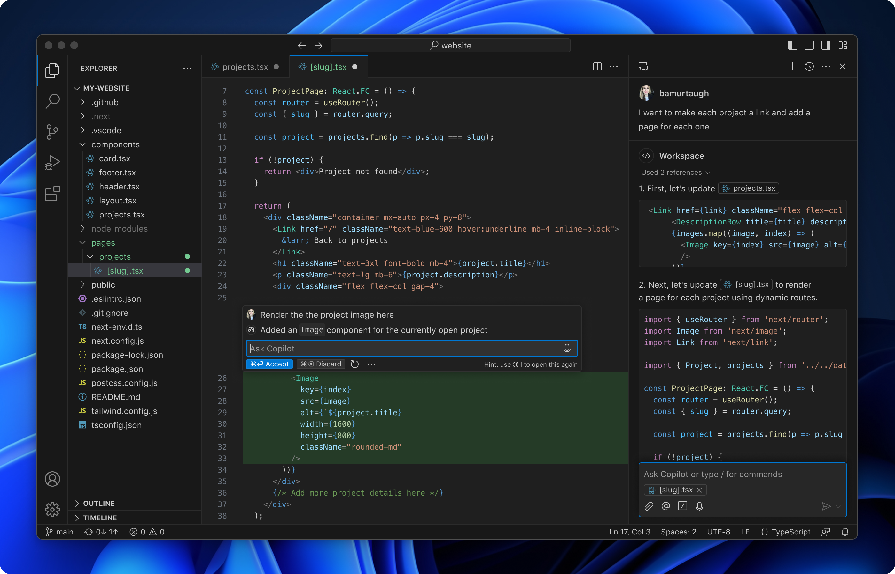

# Text Editor

Website: [https://code.visualstudio.com/](https://code.visualstudio.com/)

We are using VS Code because it is lightweight, fast, and extensible tool that can handle multiple programming languages, frameworks, and development tasks. It's well-suited for everything from web and software development to data science, automation, and remote collaboration. Whether you're working on a small script or a large-scale application, VS Code offers the flexibility and features needed for a smooth development experience.
